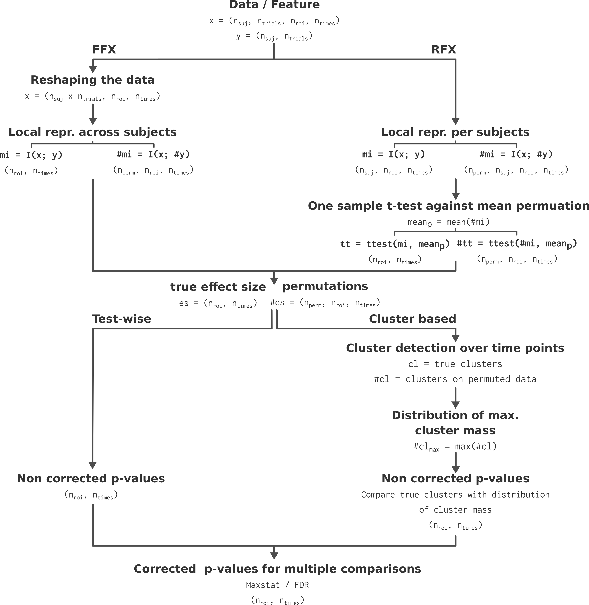

Start analyzing your data with Frites
-------------------------------------

In this section we are going to cover the basics knowledge if you want to start analyzing your data with Frites.

.. note::

    The gallery of examples contains a `tutorial <https://brainets.github.io/frites/auto_examples/index.html#tutorials>`_ section that explain and illustrate the main usages and features of Frites, in a notebook fashion.

Package organization
++++++++++++++++++++

As other Python packages, Frites contains subject-specific submodules. Here's a short description of the main submodules for new users :

* :py:mod:`frites.dataset`: : container for the electrophysiological data coming from multiple subjects (see also `those examples <https://brainets.github.io/frites/auto_examples/index.html#multi-subjects-dataset>`_ that explain how to define a container depending on your data type)
* :py:mod:`frites.workflow`: the workflows perform a series of analyzes (usually a first analysis to extract information using IT measures follow by a second statistical analysis)
* :py:mod:`frites.conn`: : directed and undirected connectivity metrics that can either be computed across trials or at the single trial level

In addition to the main modules above, the  `gallery of examples <https://brainets.github.io/frites/auto_examples/index.html>`_ illustrate the main functionalities of Frites using simulated data. Those functions can be imported from :py:mod:`frites.simulations`: and can be used to simulate local neural activity modulated by the task such as stimulus-specific brain networks using `autoregressive models <https://brainets.github.io/frites/api/api_simulations.html#stimulus-specific-autoregressive-model>`_.

Finally, for the developers here the :py:mod:`frites.core`: module include the very low level functions to estimate the mutual information (vector and tensor based implementations).

Main Frites' workflows
++++++++++++++++++++++

Frites contains two centrals workflows :

1. :class:`frites.workflow.WfMi` : the main workflow of mutual-information that is used to **extract feature-specific brain networks**
2. :class:`frites.workflow.WfStats` : the workflow of statistics we used to perform group-level inferences

Actually, under the hood, the **WfMi** is also using the workflow of statistics so that it return the estimation of mutual-information between a feature and the data but also the corresponding p-values.

.. warning::

    This workflow of mutual-information can be used for many things, including :

        * Provide a meaningful measure of effect-size between the data and a feature
        * To find some significant differences between multiple experimental conditions (``mi_type='cd``)
        * To correlate the brain data with a behavioral model (``mi_type='cc``) and possibly, independently of some experimental conditions (``mi_type='ccd``)
        * Get the corrected p-values to see whether you have a significant amount of information between your data and a feature, either at the group-level or at the subject level
        * Working on sparse data like the sEEG / iEEG where the number of subjects per brain region varies

    In a nutshell, the **WfMi** is the core workflow to find task-related activity. In addition, this workflow can either be used to quantify the amount of information between local neural activity and a feature **(i.e for each brain region)** but also on **connectivity links (i.e on pairs of brain regions)** to see whether there's some differences in term of connectivity between experimental conditions or ultimately, if the connectivity correlates with a behavioral model.

    To see this workflow in action, checkout `those examples <https://brainets.github.io/frites/auto_examples/index.html#mutual-information>`_

Step by step presentation of the workflow
+++++++++++++++++++++++++++++++++++++++++

Here is a step by step presentation of the **WfMi** and **WfStats** workflows :

1. **WfMi : effect size and permutations estimation :** the first step consist in estimating the amount of information shared between the brain data and the external variable. For the FFX, the information is computed **across subjects** while for the RFX the information is computed **per subject** (See :ref:`meth_stats_gp` for a more detailed description of the FFX and RFX). See the section about how the amount of information is computed (:ref:`meth_gcmi`) and which type of information you can use (:ref:`meth_gcmi_types`). For computing the permutations, we randomly shuffle the y variable and then recompute the MI between x and the permuted version of y. For the RFX specifically, a t-test across participants and against the permutation mean is used to form the effect at the group-level.
2. **WfStats : correction for multiple comparisons and significant testing :** we are using the 95th percentile of the permutations to form the clusters, both on the true effect size and on the permutations. Finally, for correcting for multiple comparisons and to infer the p-value, we compare the mass of the cluster with the distribution of maximums cluster mass obtained across space.

Those steps are summarized in the figure below.

    Algorithmic presentation of the statistical pipeline. Extracted from Combrisson et al., 2022 :cite:`combrisson_group-level_2022`.

For a more detailed discussion on group-level analysis, on non-parametric statistics and on corrections for multiple comparisons, see the section :ref:`meth_stats_gp`, see Combrisson et al., 2022 :cite:`combrisson_group-level_2022`.

Deep integration with Xarray
++++++++++++++++++++++++++++

`Xarray <http://xarray.pydata.org/en/stable/>`_ is a recent python package to handle of multi-dimensional arrays using labels. For those who are familiar with `Pandas <https://pandas.pydata.org/>`_, you can see Xarray as a generalization of Pandas for multi-dimensional arrays.

Xarray provide a container for the data called `DataArray <http://xarray.pydata.org/en/stable/generated/xarray.DataArray.html#xarray.DataArray>`_. This structure comes with two important inputs : 1) `dims` which describe the name of each dimension of the array and 2) `coords` the values taken by each dimension. For example you can define a DataArray with the dimensions ``('roi', 'times')`` where ``roi = ['insula', 'vmPFC', 'dlPFC']`` and ``times = np.linspace(-3, 3, 1000)``. After that, the manipulation of the data happen using the values of the coordinates. Bellow, a minimal slicing example :

.. code-block:: python

    """
    `da` is a xarray.DataArray. With the code line below, we select the data
    coming from the two brain regions Insula and vmPFC. Then we also select
    every time points comprised between [-1.5, 1.5] seconds
    """
    da.sel(roi=['insula', 'vmPFC'], times=slice(-1.5, 1.5))

The example above only show how to slice the data but actually Xarray contains most of the operations using the same label-based syntax.

.. note::

    Frites make an extensive use of Xarray as most of the outputs returned are DataArrays. Since it's a relatively recent package, we wrote `two mini tutorials <https://brainets.github.io/frites/auto_examples/index.html#xarray>`_ to start working with it.
