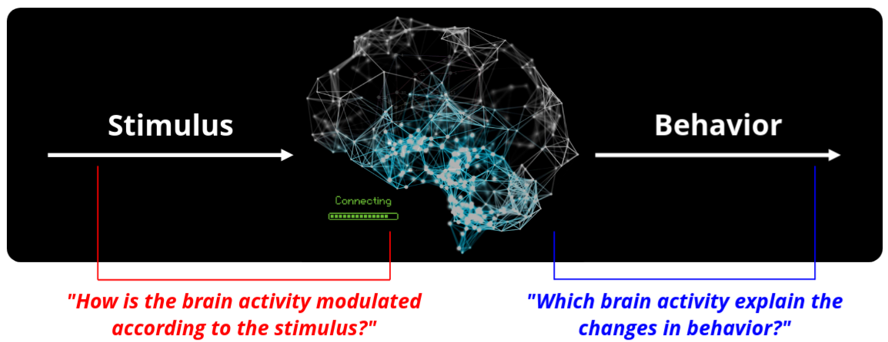

Goals of Frites
---------------

Frites is an open-source Python software started in 2019 to **analyze neurophysiological data using information theoretical (IT) measures**. Overall, the goals of Frites could be summarized as follow :

1. **Extract task-related cognitive brain networks :** i.e brain regions and connectivity between brain regions that are modulated according to the task
2. **Group-level statistical inferences :** being able to draw conclusions on a population of subjects while taking into account the the richness of data at the single subject level

Task-related and feature-specificity
++++++++++++++++++++++++++++++++++++

The stimulus of the task (e.g visual stimulus like color circles) is first going to be processed by the brain, occurring some changes in the brain activity that are related to the stimulus. This is what we called **stimulus-specific** brain activity. Once processed, this stimulus is going to introduce some changes in the behavior of the subject (e.g decision making). Following the same reasoning as above we called **behavior-specific** the modulations in the activity of the brain that can explain a change in the behavior of the subject.

Now, with Frites we try to isolate the brain activity that is either related to the stimulus or to the behavior. In a more general way, this brain activity is called **task-related** or **feature-specific** where *feature* can either refer to the *stimulus* or to the *behavior*.

IT framework to extract task-related cognitive brain networks
+++++++++++++++++++++++++++++++++++++++++++++++++++++++++++++

A brain network is composed of two things :

1. **Nodes :** the nodes of a network are the brain regions (e.g Insula / vmPFC / dlPFC form a three nodes network)
2. **Edges :** the connectivity links between the nodes (e.g comodulations or information flow)

Frites contains a collection of statistical methods to test whether :

1. The **local neural activity** (i.e the activity of a particular node of the network) is modulated by the task
2. The **connectivity** (which can be undirected or directed) between brain regions is also modulated by the task

.. figure::  ../_static/network_framework.png
    :align:  center

    Framework using information theoretical measures on neurophysiological data to extract task-related local neural activity and connectivity